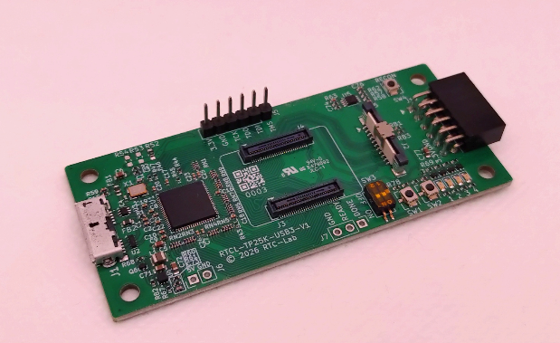
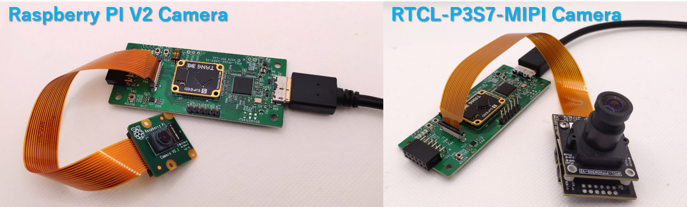
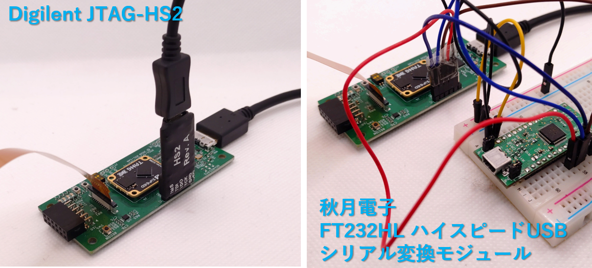
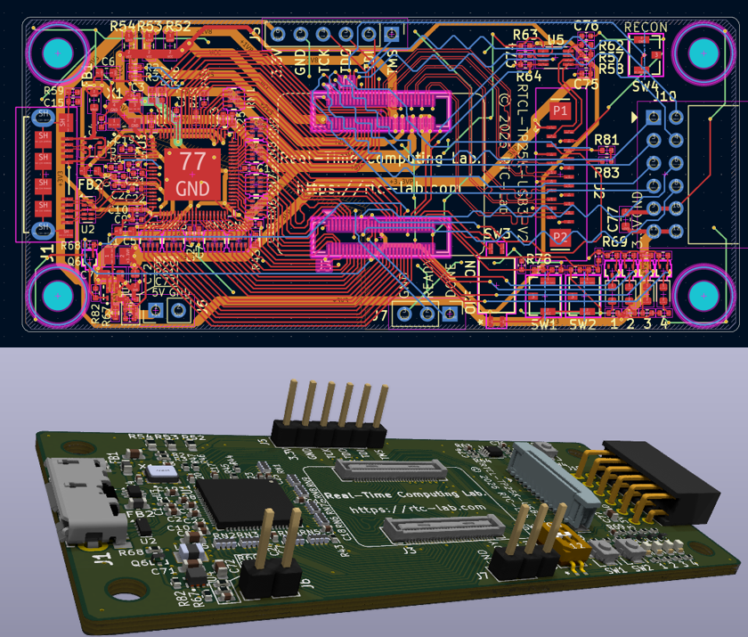

English version: [README_en.md](README_en.md)

# Tang Primer 25K 用 FT601 + MIPIコネクタ オリジナルベース基板

## 概要

Sipeed社の [Tang Primer 25K](https://wiki.sipeed.com/hardware/en/tang/tang-primer-25k/primer-25k.html) に搭載されている GW5A-LV25MG121 には MIPI D-PHY インターフェースが搭載されており、SoM までは配線が来ているようですが、残念ながら標準の Dock base board ではこのラインが未接続のままになっており、利用することができません。

本プロジェクトでは、MIPI D-PHY ラインを活用できるように 0.5mm ピッチ 22pin のコネクタに引き出したうえで、画像データなどを PC と交換できるように FT601 で USB3.0 接続できるオリジナルベース基板の設計データを提供します。

Tang Primer 25K の SoMボード でもともと使われていなかった MIPI ピンを利用するようにしていますが、特に MIPI を活用しなくとも、USB3.0 で FPGA を使えるようにしたボードとも言えますので、今まで FPGA と PC との接続で UART 程度で止まっていた人に本格的な FPGA 活用への第一歩として利用いただければ幸いです。

また、当方では試しておりませんが、GW5A-LV25MG121 の MIPI D-PHY は双方向ですので、MIPI-DSI など、表示系の実験にも利用できる可能性があります。

## スペック

主な実装内容は以下です。

- Tang-Primer25K-Core 取り付け用コネクタ
- FT601 による USB3.0 接続
- 4レーン MIPI コネクタ (22pin)
- PMOD コネクタ一個
- LED 4個
- プッシュスイッチ2個
- 2極ディップスイッチ
- JTAG 接続用 6pin ヘッダ

JTAG は外部に別途ダウンロードケーブルが必要ですが、[openFPGAloader](https://github.com/trabucayre/openFPGALoader)などを利用する場合は幅広いダウンロードケーブルが利用可能です。

また FT232HL などを利用する場合は、GOWIN EDA の GAO などを使ったデバッグも可能です。

## システムイメージ

### カメラ接続

[Raspberry PI V2 Camera](https://www.raspberrypi.com/documentation/accessories/camera.html) の接続例と、当方作の[RTCL-P3S7-MIPI](https://rtc-lab.com/products/rtcl-cam-p3s7-mipi/)の接続例です。

### JTAG接続

Digilent社の [JTAG-HS２](https://digilent.com/reference/programmers/jtag-hs2/start) の接続例と、秋月電子の[FT232HL ハイスピードUSBシリアル変換モジュール](https://akizukidenshi.com/catalog/g/g106503/) の接続例です。

## 設計データ

### 回路図

回路図は以下です。

- [rtcl-tp25k-usb3_v2.pdf](rtcl-tp25k-usb3_v2.pdf)

### KiCAD 設計データ

rtcl-tp25k-usb3 ディレクトリ以下に KiCAD 10.0 で設計したデータを格納しています。

JLCPCB の `JLC04161H-3313` で製造する想定で設計しています。

### ソフトウェア

下記にて開発中です。

https://github.com/ryuz/rtcl-designs/tree/main/projects/rtcl_tp25k_usb3

## 基板販売

当方で製造したものを[BOOTH](https://rtc-lab.booth.pm/) 及び [BASE](https://rtcl.base.shop/) にて販売中です。

詳細は下記をご覧ください。

https://rtc-lab.com/products/rtcl-design-rtcl_tp25k_usb3/

## 免責事項

本設計データは、研究開発用の試作実験に供するものであり、利用に際して発生した如何なる損害も作者は補償いたしませんので予めご了承ください。

また設計データについてもなんら品質を保証するものではありません。

## ライセンス(License)

本設計データは、[クリエイティブ・コモンズ 表示-非営利 4.0 国際 ライセンス(CC BY-NC 4.0)](https://creativecommons.org/licenses/by-nc/4.0/deed.ja)の下で提供されています。

製造した本基板の無断での販売や配布を行わない限りは、趣味や研究開発用途でご自由にお使いいただく事が出来ます。

また、商用に製造販売を希望される場合は、別途ライセンス契約を作者までご相談ください。[お問い合わせフォーム](https://rtc-lab.com/contact/)などからお問い合わせ頂けます。

## 作者情報

渕上 竜司(Ryuji Fuchikami)
[リアルタイムコンピューティング研究所](https://rtc-lab.com/)

